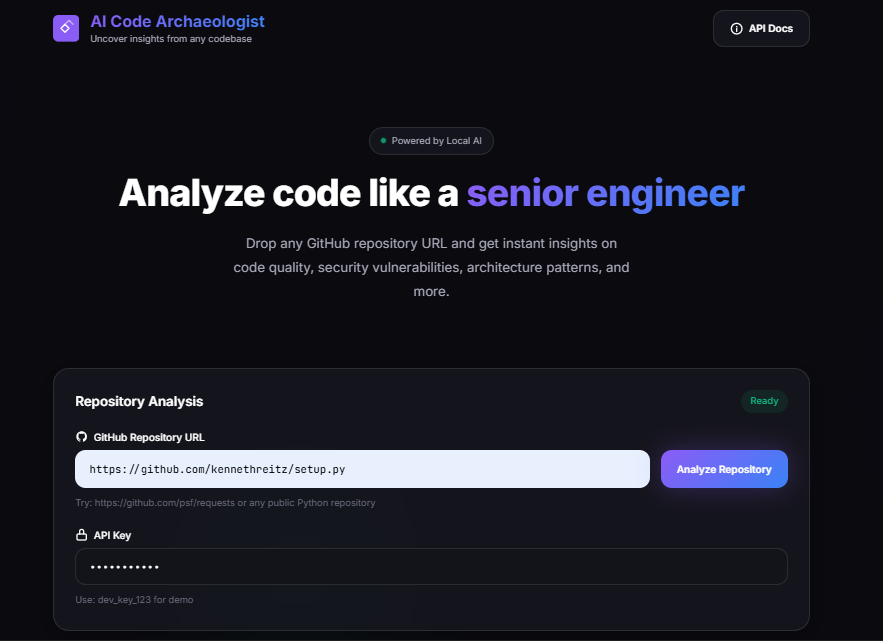
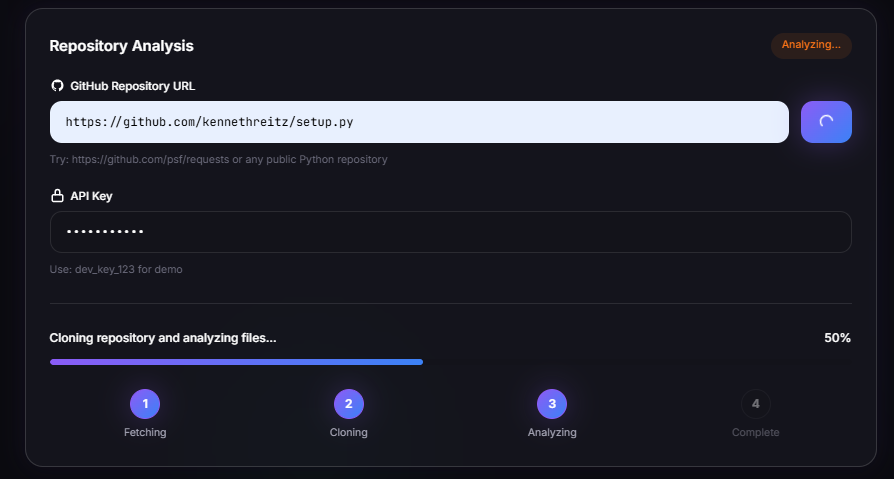
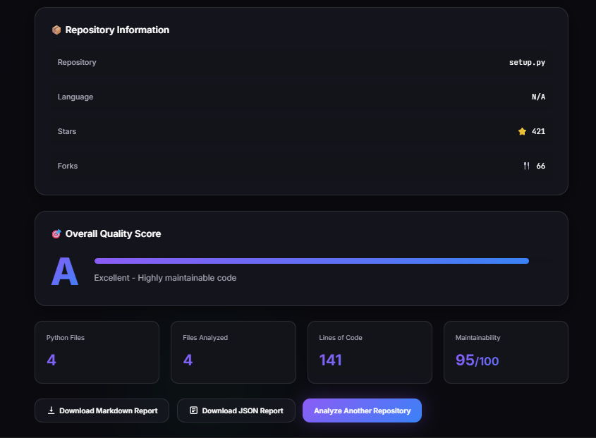

# 🤖 AI Code Archaeologist

An intelligent code analysis platform powered by AI that understands, explains, and improves code like a senior developer.


## 🎯 What It Does

AI Code Archaeologist is a production-ready platform that analyzes GitHub repositories and code using AI and advanced static analysis. It can:

- 🔍 **Clone & Analyze Real GitHub Repos** - Automatically fetch and analyze any public repository
- 🧠 **AI-Powered Insights** - Uses local LLMs (Ollama) and cloud APIs (Groq) for code understanding
- 📊 **Comprehensive Metrics** - AST parsing, complexity analysis, security scanning, architecture detection
- 💾 **Persistent Storage** - Save all analyses to database for later retrieval
- 🔒 **Production Security** - API key authentication and rate limiting
- 📈 **Quality Scoring** - Get A-F grades for code maintainability

**Perfect for:** Code reviews, repository audits, learning from open source, portfolio projects

## 🎬 Screenshots

### 🏠 Landing Page

*Clean interface*

### ⚡ Analysis in Progress

*Real-time progress tracking with visual feedback*

### 📊 Analysis Results

*Comprehensive analysis results with quality scores and insights*

---
## ✨ Features

### 🚀 GitHub Integration
- **Automatic repository cloning** - Clone any public GitHub repo
- **Batch file analysis** - Analyze entire codebases (not just single files)
- **Repository metadata** - Stars, forks, language, topics
- **File structure mapping** - Visual tree of project organization
- **Persistent storage** - Save and retrieve past analyses

### 🤖 Multi-LLM Support
- **Local AI** (Ollama with CodeLlama) - Free, private, unlimited
- **Cloud AI** (Groq) - Fast API responses
- **Easy extensibility** - Add OpenAI, Anthropic Claude

### 🔬 Advanced Code Analysis
- **AST (Abstract Syntax Tree)** parsing
- **Cyclomatic complexity** calculation
- **Maintainability index** scoring
- **Halstead metrics** for code volume/difficulty
- **Security vulnerability** detection (Bandit)
- **Dependency graph** analysis
- **Architecture pattern** detection (Singleton, Factory, Observer, etc.)
- **Code smell** detection (God classes, deep nesting, duplication)

### 🏗️ Production-Ready API
- **RESTful endpoints** with FastAPI
- **API key authentication**
- **Rate limiting** (2-20 requests/minute per endpoint)
- **Auto-generated documentation** (Swagger + ReDoc)
- **Async database operations** (SQLAlchemy)
- **Comprehensive error handling**
- **Request/response validation** (Pydantic)

## 🚀 Quick Start

### Prerequisites
- Python 3.11+
- Ollama (for local AI)

### Installation
```bash
# Clone the repository
git clone https://github.com/NidaKhaan/ai-code-archaeologist
cd ai-code-archaeologist

# Create virtual environment
python -m venv venv
venv\Scripts\activate  # Windows
# source venv/bin/activate  # Linux/Mac

# Install dependencies
pip install -r requirements.txt

# Set up environment variables
cp .env.example .env
# Edit .env with your API keys (optional for Groq)

# Install Ollama and download model
# Visit: https://ollama.com/download
ollama pull codellama:7b

# Run the server
uvicorn src.main:app --reload
```

Visit `http://127.0.0.1:8000/docs` for interactive API documentation!

## 📖 API Usage

### Analyze Code with AI
```bash
curl -X POST "http://127.0.0.1:8000/ai/explain-code" \
  -H "X-API-Key: dev_key_123" \
  -H "Content-Type: application/json" \
  -d '{
    "code": "def fibonacci(n): return n if n <= 1 else fibonacci(n-1) + fibonacci(n-2)",
    "language": "python"
  }'
```
### Analyze GitHub Repository
```bash
# Get repository info (fast)
curl -X GET "http://127.0.0.1:8000/github/info?repo_url=https://github.com/psf/requests" \
  -H "X-API-Key: dev_key_123"

# Full repository analysis (clones and analyzes)
curl -X POST "http://127.0.0.1:8000/github/analyze-full?repo_url=https://github.com/kennethreitz/setup.py&max_files=10" \
  -H "X-API-Key: dev_key_123"

# List all saved analyses
curl -X GET "http://127.0.0.1:8000/github/analyses" \
  -H "X-API-Key: dev_key_123"
```
### Deep Code Scan
```bash
curl -X POST "http://127.0.0.1:8000/analyze/deep-scan" \
  -H "X-API-Key: dev_key_123" \
  -H "Content-Type: application/json" \
  -d '{
    "code": "your_code_here",
    "include_ast": true,
    "include_complexity": true,
    "include_security": true
  }'
```

## 🏗️ Tech Stack

**Backend:**
- FastAPI - Modern Python web framework
- SQLAlchemy - Database ORM
- Pydantic - Data validation

**AI/ML:**
- Ollama - Local LLM runtime
- Groq - Fast cloud inference
- CodeLlama - Meta's code-specialized model

**Code Analysis:**
- AST (Abstract Syntax Trees) - Python built-in
- Radon - Complexity metrics
- Bandit - Security scanning

**DevOps:**
- GitHub Actions - CI/CD
- Pytest - Testing framework
- Black & Flake8 - Code quality

## 📊 Project Status

**Current Phase:** Week 3 - GitHub Integration Complete! ✅

### ✅ Completed Features:
- ✅ **Week 1:** Foundation (API, Database, Auth, CI/CD)
- ✅ **Week 2:** LLM Integration + Analysis Engines
  - Multi-LLM support (Ollama + Groq)
  - AST parsing & code structure analysis
  - Complexity metrics (Radon)
  - Security scanning (Bandit)
  - Dependency analysis
  - Architecture pattern detection
- ✅ **Week 3:** GitHub Repository Integration
  - GitHub API integration
  - Repository cloning (GitPython)
  - Multi-file batch analysis
  - Database persistence
  - Analysis retrieval endpoints

### 📈 Project Stats:
- **32+ Tests** - All passing ✅
- **15+ API Endpoints** - Fully documented
- **8+ Analysis Features** - From AST to security
- **2 Database Models** - Analysis + GitHub repos
- **100% Free** - No API costs (local LLM)

### 📅 Next Steps:
- [ ] Report generation (Markdown/JSON exports)
- [ ] Web UI (React or simple HTML)
- [ ] Cloud deployment (Railway/Render)
- [ ] Support for more languages (JavaScript, TypeScript, Go)

## 🧪 Testing
```bash
# Run all tests (32+ tests)
pytest tests/ -v

# Run with coverage
pytest tests/ --cov=src --cov-report=term-missing

# Run specific test files
pytest tests/test_api.py -v          # API endpoints
pytest tests/test_analyzers.py -v    # Code analysis
pytest tests/test_github.py -v       # GitHub integration
pytest tests/test_database.py -v     # Database operations
```

**Current Test Coverage:** 32+ tests covering:
- ✅ API endpoints (auth, rate limiting)
- ✅ Database operations (CRUD, relationships)
- ✅ Code analysis (AST, complexity, security)
- ✅ Architecture detection
- ✅ Dependency analysis
- ✅ GitHub integration (cloning, API calls)
- ✅ LLM providers (Ollama, Groq)

## 🤝 Contributing

This is a learning project, but feedback is welcome! Feel free to open issues or suggest improvements.

## 📄 License

MIT License - See LICENSE file for details

## 👨‍💻 Author
Built this as part of my AI Engineering journey.

**Connect with me:**
- GitHub: https://github.com/NidaKhaan
- Portfolio: [Coming Soon]

---

⭐ Star this repo if you find it useful!